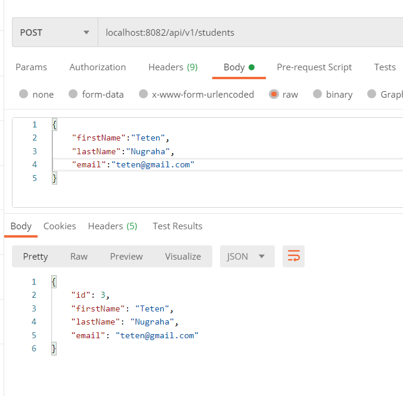
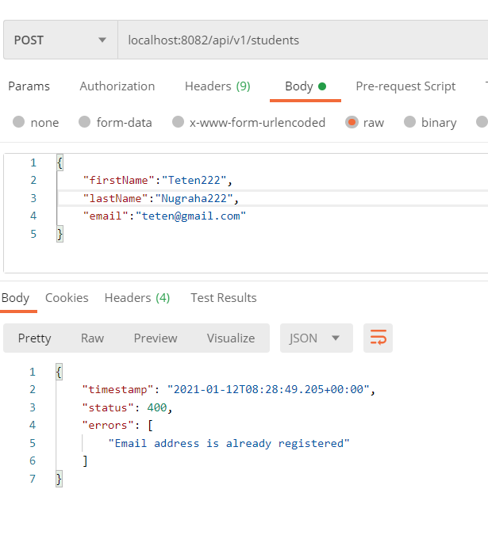

## **Contoh Implementasi Cek Nilai Unique Email di Spring Data Jpa**

Repositori ini merupakan hasil experiment penulis dalam mengimplementasikan validasi email yang sifat nya harus unik. Repo ini menggunakan **custom annotation** untuk membuat validasi email.

### Prerequisites

Sebelum mencoba repo ini alahkan baiknya dalam local host anda sudah terinstall :

1. OpenJDK 11

2. Kafka

3. Docker

4. Java IDE

   

#### Cara Penggunaan

1. Clone repo
2. Running MySQL di local 
3. masuk ke application.yml dan sesuaikan **username** dan **password**
4. running Aplikasi

#### Library yang digunakan

1. Spring Boot Data Jpa

2. Spring Boot Validation

3. Spring Boot Web

4. Lombok

   

#### **Screenshoot**

